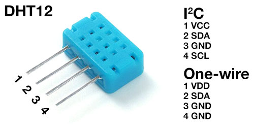

# MicroPython DHT12 I2C

A MicroPython library for interfacing with an Aosong DHT12 temperature and humidity sensor over I2C.

This library focuses on using the I2C interface. The sensor also supports a 1-wire interface, available when pin 4 is connected to GND.



#### Examples

Basic measurement

```
import dht12
from machine import I2C, Pin
i2c = I2C(scl=Pin(5), sda=Pin(4))
sensor = dht12.DHT12(i2c)
sensor.measure()
print(sensor.temperature())
print(sensor.humidity())
```

Continuous measurement

```
import time
import dht12
from machine import I2C, Pin
i2c = I2C(scl=Pin(5), sda=Pin(4))
sensor = dht12.DHT12(i2c)

while True:
	sensor.measure()
	print(sensor.temperature())
	print(sensor.humidity())
	time.sleep_ms(4000)
```

For full documentation see http://micropython-dht12.rtfd.io/.
